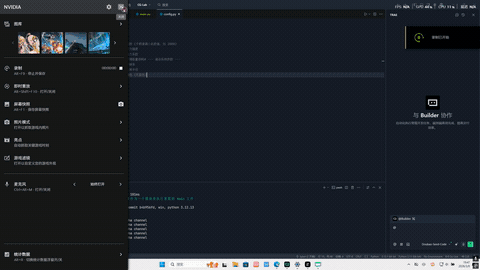

# 鼠标引力粒子系统
基于 Taichi 的 GPU 加速粒子仿真，粒子跟随鼠标移动，受引力和空气阻力影响。

## 项目结构

- `src/Work0/config.py` - 参数配置
- `src/Work0/physics.py` - GPU 物理计算
- `src/Work0/main.py` - 交互与渲染

## 物理原理

- **引力**：粒子受鼠标位置吸引，加速度恒定指向鼠标
- **阻力**：每帧速度衰减 2%
- **边界反弹**：碰到窗口边缘反弹并损失能量

## 运行效果

## 仓库地址

https://github.com/tybxt/zuoye1
